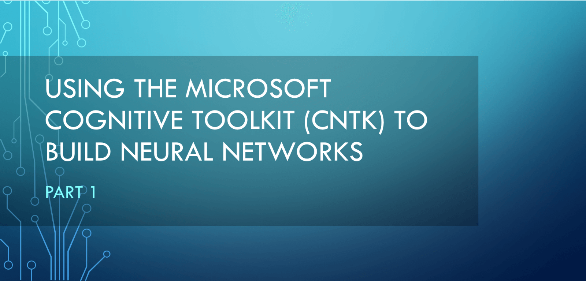
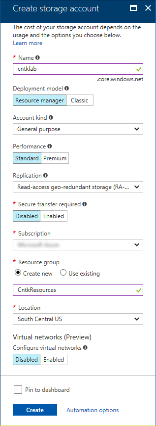
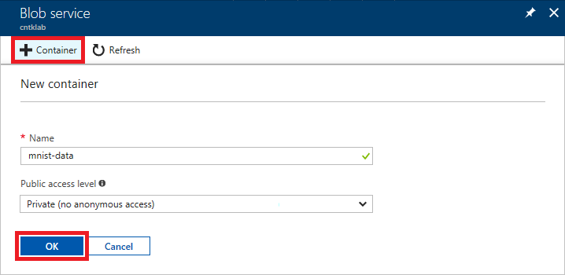
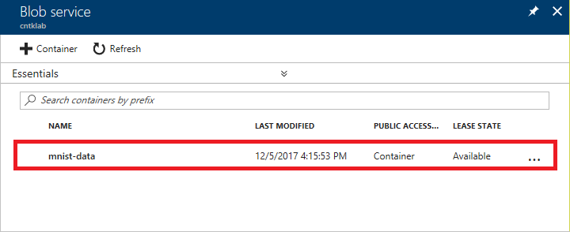
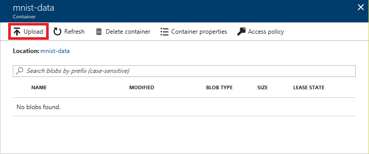
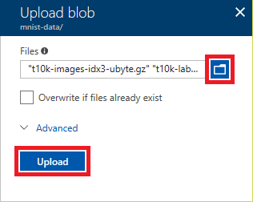
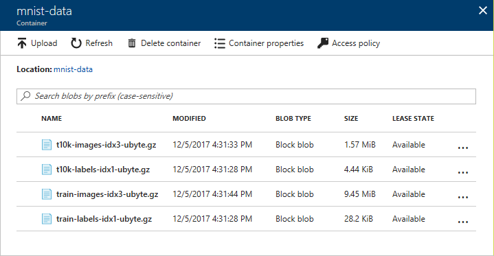

The [Microsoft Cognitive Toolkit](https://www.microsoft.com/en-us/research/product/cognitive-toolkit/), also known as the Computational Network Toolkit (CNTK), is a powerful set of free and open-source tools for developing deep-learning applications. It was initially developed by computer scientists at Microsoft to aid in their own research, was later adopted by Bing and other product groups, and is now being used by Microsoft customers. It can run on a single machine with a single CPU, or scale efficiently across multiple machines with multiple CPUs and NVIDIA GPUs, including Azure's [GPU offering](https://azure.microsoft.com/en-us/blog/azure-n-series-preview-availability/). The toolkit supports C#, C++, and Python and includes a number of libraries and utilities for processing speech, images, text, and video, as well as examples demonstrating how to use them. For more information on its history, its uses, and its capabilities, see https://blogs.microsoft.com/next/2016/10/25/microsoft-releases-beta-microsoft-cognitive-toolkit-deep-learning-advances.

The toolkit centers around machine learning with [neural networks](https://en.wikipedia.org/wiki/Artificial_neural_network). Machine learning enables computers to discern patterns in data that are difficult to identify algorithmically. Imagine trying to write an algorithm to identify images containing cats. The algorithm might scan the image looking for features characteristic of cats such as pointed ears, whiskers, and slit pupils, but identifying those features by examining individual pixels and groups of pixels would be difficult. By contrast, a machine-learning model trained with hundreds of thousands of cat images could "learn" to identify cats from patterns in the data without explicitly understanding what those patterns represent. Machine learning touches lives every day and is widely used in industry to flag fraudulent credit-card transactions, generate online shopping recommendations, and more.

In this lab, the first of four in a series, you will download a dataset and upload it to Azure blob storage. The dataset that you will upload is the [MNIST database](http://yann.lecun.com/exdb/mnist/), which is a popular dataset for training and evaluating handwriting-recognition models. The database contains 60,000 scanned and normalized images of the digits 0 through 9 drawn by high school students. It also includes a set of 10,000 test images for evaluating a model's accuracy. In subsequent labs, you will create a neural network and use the MNIST dataset to train it to recognize handwritten digits.

### Objectives ###

In this hands-on lab, you will learn how to:

- Create an Azure storage account
- Upload files to Azure blob storage

### Prerequisites ###

The following are required to complete this hands-on lab:

- An active Microsoft Azure subscription. If you don't have one, [sign up for a free trial](http://aka.ms/WATK-FreeTrial).

---

## Exercises ##

This hands-on lab includes the following exercises:

- [Exercise 1: Create a storage account](#Exercise1)
- [Exercise 2: Upload data to blob storage](#Exercise2)

Estimated time to complete this lab: **15** minutes.

## Exercise 1: Create a storage account ##

The [Azure Portal](https://portal.azure.com) allows you to perform basic storage operations such as creating storage accounts, viewing what's stored under those accounts, and managing the access keys associated with the accounts. In this exercise, you'll use the portal to create a storage account.

1. Open the [Azure Portal](https://portal.azure.com/) in your browser. If you are asked to sign in, do so with your Microsoft account.
 
1. To create a storage account, click **+ New** in the ribbon on the left. Then click **Storage**, followed by **Storage account**.

    

    _Adding a storage account_

1. In the ensuing blade, enter a name for the new storage account in **Name** field. The name is important, because it forms one part of the URL through which blobs created under this account can be accessed.

	> Storage account names can be 3 to 24 characters in length and can only contain numbers and lowercase letters. In addition, the name you enter must be unique within Azure; if someone else has chosen the same name, you'll be notified that the name isn't available with a red exclamation mark in the **Name** field.

	Once you have a unique name that Azure will accept, select **Create new** under **Resource group** and type "CntkResources" (without quotation marks) into the box below to name the resource group that will be created for the storage account. Select the location nearest you in the **Location** box. Then click the **Create** button at the bottom of the blade.
    
	

    _Creating a storage account_

1. Click **Resource groups** in the ribbon on the left side of the portal to list all of your resource groups. In the "Resource groups" blade, click the resource group whose name you entered in the previous step.

1. Wait until "Deploying" changes to "Succeeded," indicating that the storage account has been deployed. (You can click the **Refresh** button at the top of the blade to refresh the deployment status.) Then click the storage account.

	

    _Opening the storage account_

1. In the blade for the storage account, click **Blobs** to view a list of blob containers.

    

    _Viewing blob containers_

1. The storage account currently has no containers. Before you create a blob, you must create a container to store it in. A container is similar to a folder in a file system. A storage account can have an unlimited number of containers, and a container can store an unlimited number of blobs. Container names must be from 3 to 63 characters in length and may contain numbers, dashes, and lowercase letters.

	Click **+ Container** to create a new container. Enter "mnist-data" as the container name, and accept the default **Public access level** of **Private** so blobs stored in this container are not publicly accessible. Then click **OK**.

    

    _Creating a container_

You now have a storage account in which you can store blobs, and a container to store them in. The next step is to upload a dataset to the container.

## Exercise 2: Upload data to blob storage ##

In this exercise, you will the MNIST dataset to your local computer, and then upload it to the container you created in the previous exercise. The dataset comprises four compressed GZ files containing images for training and testing as well as labels for training and testing.

1. Download the files from the following URLs and save them on your hard disk:

	- [http://yann.lecun.com/exdb/mnist/train-images-idx3-ubyte.gz](http://yann.lecun.com/exdb/mnist/train-images-idx3-ubyte.gz)
	- [http://yann.lecun.com/exdb/mnist/train-labels-idx1-ubyte.gz](http://yann.lecun.com/exdb/mnist/train-labels-idx1-ubyte.gz)
	- [http://yann.lecun.com/exdb/mnist/t10k-images-idx3-ubyte.gz](http://yann.lecun.com/exdb/mnist/t10k-images-idx3-ubyte.gz)
	- [http://yann.lecun.com/exdb/mnist/t10k-labels-idx1-ubyte.gz](http://yann.lecun.com/exdb/mnist/t10k-labels-idx1-ubyte.gz)

	These files contain the raw data for the MNIST dataset.

1. Return to the Azure Portal in your browser and click the container you created in [Exercise 1](#Exercise1).

	

	_Opening the container_

1. Click **Upload**.

	

	_Uploading the dataset_

1. Click the folder icon and browse to the directory in which you saved the four GZ files. Then select all four files and click the **Upload** button to upload them to the container. 

	

	_Uploading the dataset_

1. Close the "Upload Blob" blade and confirm that all four files uploaded successfully.

	

	_The uploaded MNIST data_

The MNIST data is now in blob storage, where it can be accessed externally by URL. For example, the first of the four files can be read from https://cntklab.blob.core.windows.net/mnist-data/t10k-images-idx3-ubyte.gz. In the next lab, you will use [Azure Machine Learning Workbench](https://docs.microsoft.com/azure/machine-learning/preview/quickstart-installation) to prepare the data to be used in a machine-learning model by converting it to CNTK format.

## Summary ##

The Azure Portal makes it easy to create storage accounts, create containers inside those storage accounts, and upload blobs to the containers. Now that you have the MNIST dataset uploaded to blob storage, proceed to the next lab in this series — [Using the Microsoft Cognitive Toolkit (CNTK) to Build Neural Networks, Part 2](../2%20-%20Process) — to begin shaping the dataset for use in machine learning.

---

Copyright 2018 Microsoft Corporation. All rights reserved. Except where otherwise noted, these materials are licensed under the terms of the MIT License. You may use them according to the license as is most appropriate for your project. The terms of this license can be found at https://opensource.org/licenses/MIT.
