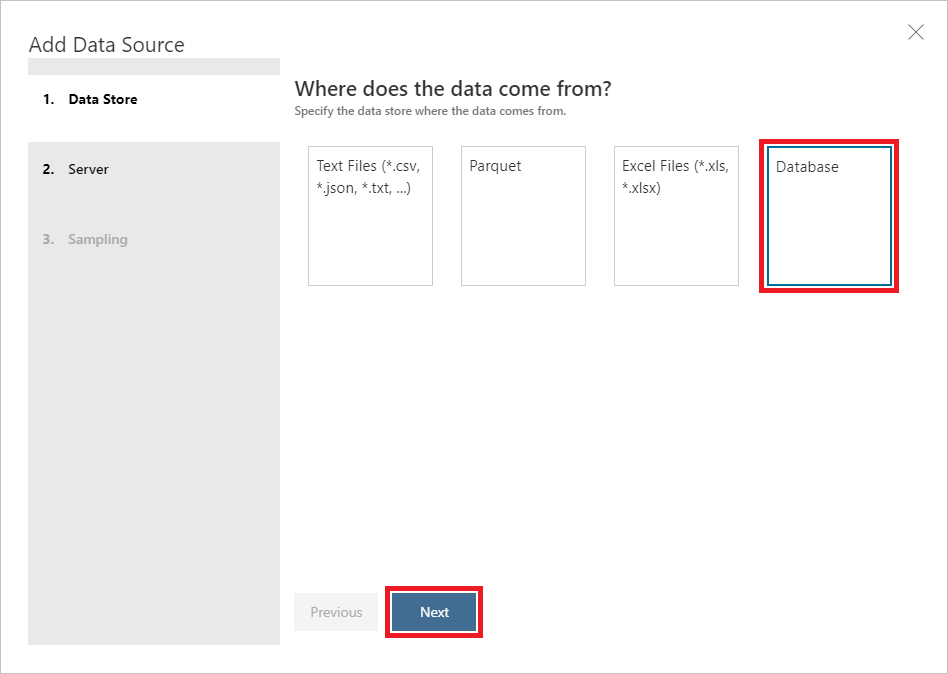
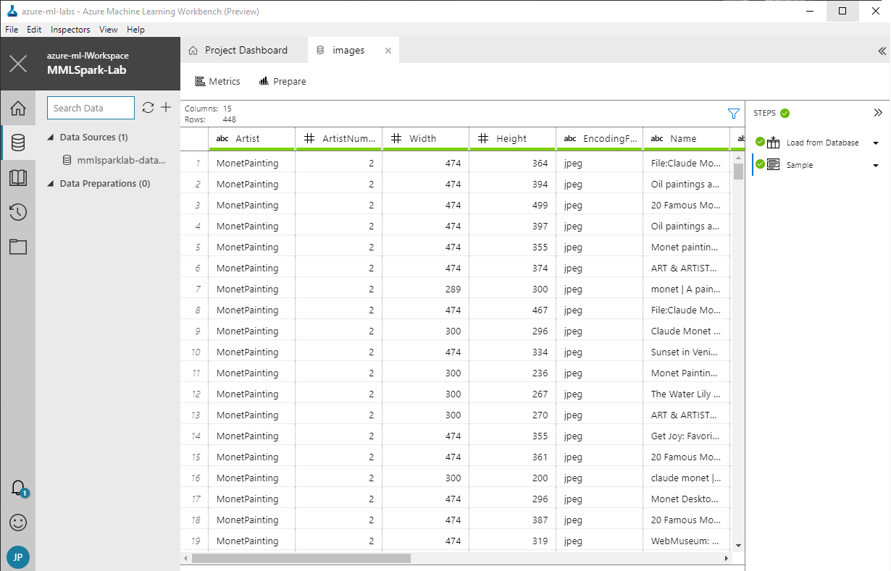
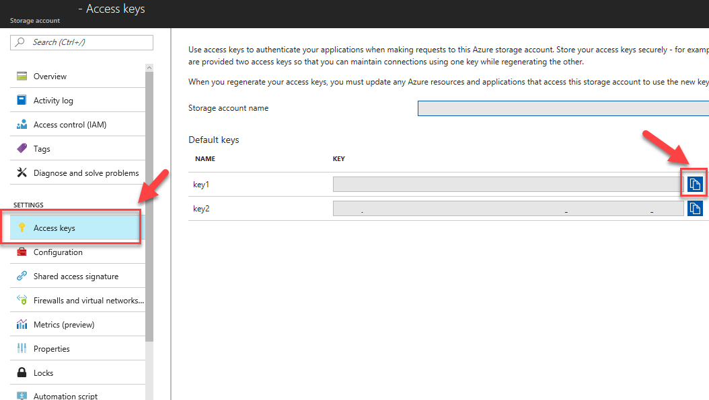

In this lab, the second of four in a series, you will prepare the data that you generated and stored in an Azure SQL database in the [previous lab](../1%20-%20Ingest) so that it can be used to train a machine-learning model that performs image classification. Preparation will involve using a technique called [perceptual image hashing](https://www.pyimagesearch.com/2017/11/27/image-hashing-opencv-python/) to identify images that are identical or highly similar so the model won't be biased by training it with multiple variations of the same image. In the [next lab](../3%20-%20Predict), you will use the images that you generated to train a machine-learning model that recognizes the artists of famous paintings.


<a name="Objectives"></a>
### Objectives ###

In this hands-on lab, you will learn how to:

- Use an Azure SQL database as a data source in Machine Learning Workbench
- Use [OpenCV](https://opencv.org/) to normalize images
- Use perceptual image hashing to identify similar images

<a name="Prerequisites"></a>
### Prerequisites ###

The following are required to complete this hands-on lab:

- An active Microsoft Azure subscription. If you don't have one, [sign up for a free trial](http://aka.ms/WATK-FreeTrial).
- [Azure Machine Learning Workbench](https://docs.microsoft.com/en-us/azure/machine-learning/preview/quickstart-installation)
- [Docker](https://www.docker.com/)

If you haven't completed the [previous lab in this series](../1%20-%20Ingest), you must do so before starting this lab.

---

<a name="Exercises"></a>
## Exercises ##

This hands-on lab includes the following exercises:

- [Exercise 1: Connect to Azure SQL from ML Workbench](#Exercise1)
- [Exercise 2: Create a Standard Azure Blob Storage for Images](#Exercise2)
- [Exercise 3: Determine Unique Paintings with a Pandas DataFrame](#Exercise3)
- [Exercise 4: Upload Unique Painting Thumbnails into Azure Blob Storage](#Exercise4)

Estimated time to complete this lab: **40** minutes.

<a name="Exercise1"></a>
## Exercise 1: Connect to Azure SQL from ML Workbench ##

In this exercise, you will connect to the Azure SQL database you created in the previous lab from Azure Machine Learning Workbench by specifying the database as a data source.

1. Open the [Azure Portal](https://portal.azure.com) in your browser. If asked to log in, do so using your Microsoft account.

1. Launch Azure Machine Learning Workbench and open the project that you created in the previous lab. Then click the **Data** icon in the ribbon on the left, click the **+** sign, and select **Add Data Source**.

	

	_Adding a data source_

1. Click **Database**, and then click the **Next** button.

	

	_Adding a database as a data source_

1. In the **Server Address** box, enter "SERVER_NAME.database.windows.net" (without quotation marks), where SERVER_NAME is the name you assigned to the database server in the previous lab. Make sure **Server** is selected as the **Authentication Type**, and enter the admin user name and password that you specified in the previous lab for logging in to the database. In **Database To Connect To**, enter the name you assigned to the database in the previous lab. Then scroll down and enter the following statement into the **Query** box:

	```
	SELECT * FROM dbo.Paintings
	```

	Then finish up by clicking the **Finish** button.

	

	_Adding an Azure SQL database as a data source_

1. Confirm that the contents of the "Paintings" table appears in ML Workbench, complete with columns named "Artist," "Width," "Height," and "URL."

	

	_Data imported from the Azure SQL database_

1. tk.

	

	_tk_

1. tk.

	

	_tk_

1. tk.

	

	_tk_

TODO: Add closing.

<a name="Exercise2"></a>
## Exercise 2: Create a Standard Azure Blob Storage for Images ##

In this exercise, you will use the Azure CLI to create an Azure storage account in the cloud. This storage account will store as blobs images acquired from Bing Image Search, and subsequently be used for the HDInsight Spark cluster. Note that you can also create storage accounts using the [Azure Portal](https://portal.azure.com). Whether to use the CLI or the portal is often a matter of personal preference.

1. If the Azure CLI 2.0 isn't installed on your computer, go to https://docs.microsoft.com/cli/azure/install-azure-cli and install it now. You can determine whether the CLI is installed — and what version is installed — by opening a Command Prompt or terminal window and typing the following command:

	```
	az -v
	```

	If the CLI is installed, the version number will be displayed. If the version number is less than 2.0.23, **download and install the latest version**.

	> As an alternative to installing the Azure CLI, you can use the [Azure Cloud Shell](https://azure.microsoft.com/features/cloud-shell/) available in the [Azure Portal](https://portal.azure.com). Simply open the portal in your browser and click the **Cloud Shell** button in the toolbar at the top of the page. One of the benefits of using the Cloud Shell is that you're *always* running the latest version.

	

	_Opening the Azure Cloud Shell_

1. Now use the following command to create a general-purpose storage account in the "mmlsparklab-rg" resource group created in lab one. Replace ACCOUNT_NAME with the name you wish to assign the storage account. The account name must be unique within Azure, so if the command fails because the storage-account name is already in use, change the name and try again. In addition, storage-account names must be from 3 to 24 characters in length and can contain only numbers and lowercase letters.

	```
	az storage account create --name ACCOUNT_NAME --resource-group mmlsparklab-rg --location southcentralus --kind Storage --sku Standard_LRS
	```

1. Before you can upload blobs to a storage account, you must create a container to store them in. Use the following command to create a container named "images" in the storage account, replacing ACCOUNT_NAME with the name you assigned to the storage account in the previous step:

	```
	az storage container create --name images --account-name ACCOUNT_NAME
	```
1. Use the Azure Portal to obtain the ACCESS KEY for this newly created Storage Account.

	

	_Copying the Access Key_

You now have a storage account for storing images for this lab, and a container to store them in. Now let's determine the set of unique paintings for this lab.


<a name="Exercise3"></a>
## Exercise 3: Determine Unique Paintings with a Pandas DataFrame ##

Why do we need unique paintings?  Many images may be returned in a general web search, and we need to assure that we don't have the same image in the training and testing set.  

In this section, we use a Pandas DataFrame to read information from SQL Azure.  SQL Alchemy is the name of a package which allows many convenient functions to complement Pandas DataFrames; even though the full range of functions is beyond scope of this lab, we are using SQL Alchemy to run SQL code at the database.

The SQL query leverages window functions, whose full scope allows for feature creation (especially for time series).  In this lab, we simply need to use the ```ROW_NUMBER``` function to achieve our deduplication goals.

While it would be possible to ```SELECT...INTO``` a new table, we are instead reading the resulting query into a Pandas DataFrame.  In more complicated projects, this technique could be extended to add additional features through the Python environment.  The final DataFrame is then uploaded to a new table.

1. Open **uniquePaintings.py** for editing in Machine Learning Workbench and paste in the following Python code:

    ```python
    # Unique Paintings
    #
    # Use case:
    # 1) pre-processing data with Python as Pandas
    # 2) leverage dhash engine
    # 3) achieving pre-processing in Azure ML Workbench

    # SQL Alchemy for full relational power
    # http://docs.sqlalchemy.org/en/latest/core/engines.html
    from sqlalchemy import create_engine
    import pyodbc 

    # Pandas for DataFrame
    # https://pypi.python.org/pypi/pandas
    import pandas as pd

    # Numpy
    import numpy as np

    # Create Engine
    # http://docs.sqlalchemy.org/en/latest/dialects/mssql.html#module-sqlalchemy.dialects.mssql.pyodbc
    engine = create_engine("mssql+pyodbc://<ADMIN_USERNAME>:<ADMIN_PASSWORD>@<SERVER_NAME>.database.windows.net:1433/<DATABASE_NAME>?driver=ODBC+Driver+13+for+SQL+Server")

    # Custom SQL Query to remove duplicates
    # Solution uses T-SQL window functions https://docs.microsoft.com/en-us/sql/t-sql/queries/select-over-clause-transact-sql
    # Result set keeps the largest width image (then largest height) if the hash is equivalent
    sql = "WITH RowTagging \
        AS (SELECT [Artist], \
                [ArtistNumber], \
                [Width], \
                [Height], \
                [EncodingFormat], \
                [Name], \
                [URL], \
                [DHashHex3], \
                ROW_NUMBER() OVER (PARTITION BY DHashHex3 ORDER BY Width DESC, Height DESC) AS RowNumber \
            FROM [dbo].[Paintings]) \
        SELECT R.Artist, \
            R.ArtistNumber, \
            R.Width, \
            R.Height, \
            R.EncodingFormat, \
            R.Name, \
            R.URL, \
            R.DHashHex3 \
        FROM RowTagging R \
        WHERE RowNumber = 1;"

    # Run SQL Query in SQL Azure, return results into Pandas DataFrame
    # http://pandas.pydata.org/pandas-docs/stable/generated/pandas.read_sql.html
    df = pd.read_sql(sql, engine)
    print("Columns: ", list(df.columns.values))
    print("DataFrame Shape: ", df.shape)

    # Assign a random column using numpy
    df['Random'] = np.random.rand(df.shape[0])

    # Output Pandas DataFrame to SQL Azure
    # Note that the output would add an index by default
    # http://pandas.pydata.org/pandas-docs/stable/generated/pandas.DataFrame.to_sql.html
    df.to_sql('UniquePaintings', engine, if_exists='replace', index=False)
    ```
1. Replace the following values in **uniquePaintings.py**. Then save the file.

	- Replace ADMIN_USERNAME on line 22 with the admin name you specified in Lab 1, Exercise 1, Step 3
	- Replace ADMIN_PASSWORD on line 22 with the admin password you specified in Lab 1, Exercise 1, Step 3
	- Replace SERVER_NAME on line 22 with the server name you specified in Lab 1, Exercise 1, Step 3
	- Replace DATABASE_NAME on line 22 with the database name you specified in Lab 1, Exercise 1, Step 5

1. As with Exercise 1, use the Azure ML Workbench to open the new datasource, the table named ```UniquePaintings```.

	

	_tk_

1.  Using the Azure portal, navigate to the ```images``` database, and using Data Explorer, look at the data in the new table ```UniquePaintings```.

	

	_tk_


In this exercise, we started with a table called ```Paintings``` and using a Pandas DataFrame, created a new table called ```UniquePaintings```.  Further navigation is possible either using the Azure ML Workbench or the Data Exploer from the Azure portal.

<a name="Exercise4"></a>
## Exercise 4: Upload Unique Painting Thumbnails into Azure Blob Storage ##

In this section, we use the UniquePaintings SQL Azure table created in Exercise 3 to populate the Azure Blob Storage.  It is possible to store images in SQL Azure using VARBINARY fields:  however, the typical best practice is saving images in secured locations like Azure Blob Storage.  You may control access to this storage, either on a permanent or temporary basis.

1. Open **blobUpload.py** for editing in Machine Learning Workbench and paste in the following Python code:

    ```python
    # Blob Upload
    #
    # Use case:
    # 1) accessing Azure blob from Python in Workbench
    # 2) using SQL Azure URLs as the source
    # 3) sending a binary stream directly to Azure Blob
    # 4) sending metadata files to the Azure Blob (map.txt and uniqueclasses.txt)

    from azure.storage.blob import BlockBlobService

    # Allows public access to the container
    from azure.storage.blob import PublicAccess

    # Transfer objects to/from Azure Blob storage using Python: https://docs.microsoft.com/en-us/azure/storage/blobs/storage-quickstart-blobs-python
    from azure.storage.blob import ContentSettings

    # Allow appending to blob
    from azure.storage.blob import AppendBlobService

    # SQL Alchemy for full relational power
    # http://docs.sqlalchemy.org/en/latest/core/engines.html
    from sqlalchemy import create_engine
    import pyodbc 

    # Pandas for DataFrame
    # https://pypi.python.org/pypi/pandas
    import pandas as pd

    # HTTP for humans
    # https://pypi.python.org/pypi/requests
    import requests

    # PIL for image generation
    # https://pypi.python.org/pypi/Pillow
    from PIL import Image

    # BytesIO to obtain from URL
    # https://wiki.python.org/moin/BytesIO
    from io import BytesIO

    # StringIO to create TXT files
    # https://docs.python.org/3/library/io.html
    from io import StringIO

    # Access your blob storage
    # Help on using Azure Blob in Python:  https://docs.microsoft.com/en-us/azure/storage/blobs/storage-python-how-to-use-blob-storage
    # Azure Storage Services REST API Reference: https://docs.microsoft.com/en-us/rest/api/storageservices/Azure-Storage-Services-REST-API-Reference
    myaccount = '<ACCOUNT NAME>'
    mykey = '<ACCESS KEY>'
    block_blob_service = BlockBlobService(account_name=myaccount, account_key=mykey)

    # Set Container ACL:  https://docs.microsoft.com/en-us/rest/api/storageservices/set-container-acl
    block_blob_service.set_container_acl('images', public_access=PublicAccess.Container)

    # Create Engine
    # http://docs.sqlalchemy.org/en/latest/dialects/mssql.html#module-sqlalchemy.dialects.mssql.pyodbc
    engine = create_engine("mssql+pyodbc://<ADMIN_USERNAME>:<ADMIN_PASSWORD>@<SERVER_NAME>.database.windows.net:1433/<DATABASE_NAME>?driver=ODBC+Driver+13+for+SQL+Server")

    # Create Directory stem for HDInsight
    azure_blob_root = 'wasbs://images@marktabblob.blob.core.windows.net/'
    url_blob_root = 'https://marktabblob.blob.core.windows.net/images/'

    # Read a SQL Table into Pandas DataFrame
    # http://pandas.pydata.org/pandas-docs/stable/generated/pandas.read_sql_table.html
    df = pd.read_sql_table('UniquePaintings', engine)
    print("Columns: ", list(df.columns.values))
    print("DataFrame Shape: ", df.shape)

    # Array of valid image encodings
    encodingarray = ['jpeg','bmp','png','gif']
    container_name = 'images'
    paintings_stem = 'Image/DataSets/Paintings/'
    training_blob_name = paintings_stem + 'Train/map.txt'
    testing_blob_name = paintings_stem + 'Test/map.txt'
    uniqueclass_blob_name = paintings_stem + 'uniqueclasses.txt'
    transfer_images_blob_name = paintings_stem + 'transferimages.txt'

    # Create empty StringIO objects to allow appending
    training_stream = StringIO()
    testing_stream = StringIO()
    uniqueclasses_stream = StringIO()
    transfer_images_stream = StringIO()

    uniqueClasses = []
    for index, row in df.iterrows():
        if row['EncodingFormat'] in encodingarray:
            print (row['URL'],row['DHashHex3'],row['EncodingFormat'])

            # Assign to test or train (80/20 split) based on the random number value
            # Because the random number is stored, you may modify to a different split value
            # Also, build a map.txt file in the appropriate directory
            # How to use Azure Blob Storage: https://docs.microsoft.com/en-us/azure/storage/blobs/storage-python-how-to-use-blob-storage
            if row['Random'] < .80:
                image_base = row['Artist'] + "/" + row['DHashHex3'] + "." + row['EncodingFormat']
                image_blob_name = paintings_stem + "Train/" + image_base
                training_output = "DataSets/Paintings/Train/" + image_base + " " + str(row['ArtistNumber']) + '\n'
                training_stream.write(training_output)
            else:
                image_base = row['Artist'] + "/" + row['DHashHex3'] + "." + row['EncodingFormat']
                image_blob_name = paintings_stem + "Test/" + image_base
                testing_output = "DataSets/Paintings/Test/" + image_base + " " + str(row['ArtistNumber']) + '\n'
                testing_stream.write(testing_output)

            # Single stream for all uploaded images for transferring into HDInsight file system
            transfer_images_stream.write(url_blob_root + image_blob_name + ' ' + image_base + '\n')

            # Accumulate Unique Classes
            if row['Artist'] not in uniqueClasses:
                uniqueClasses.append(row['Artist'])  

            # Acquire image:  "response" could be saved as an image file
            # response = requests.get(row['URL'], stream=True)

            # Convert to Binary Stream
            # https://docs.python.org/3/library/io.html
            image_stream = BytesIO(requests.get(row['URL'], stream=True).content)
            imagecontent = "image/" + row['EncodingFormat']

            # azure.storage.blob.blockblobservice module http://azure.github.io/azure-storage-python/ref/azure.storage.blob.blockblobservice.html
            block_blob_service.create_blob_from_stream(container_name, image_blob_name, image_stream, content_settings=ContentSettings(content_type=imagecontent))

            # memory management
            del image_stream

    # Write number of unique classes
    uniqueclasses_stream.write(str(len(uniqueClasses)))

    # write to block blobs:  using create_blob_from_text 
    block_blob_service.create_blob_from_text(container_name, training_blob_name, training_stream.getvalue())
    block_blob_service.create_blob_from_text(container_name, testing_blob_name, testing_stream.getvalue())
    block_blob_service.create_blob_from_text(container_name, uniqueclass_blob_name, uniqueclasses_stream.getvalue())
    block_blob_service.create_blob_from_text(container_name, transfer_images_blob_name, transfer_images_stream.getvalue())

    # memory management
    del training_stream
    del testing_stream
    del uniqueclasses_stream
    del transfer_images_stream
    ```

Only files of type ```jpeg```, ```bmp```, ```png```, and ```gif``` are being used in this lab (the list being in a modifiable array).

1. Replace the following values in **blobUpload.py**. Then save the file.

	- Replace ACCOUNT_NAME on line 50 with the account name you specified in Exercise 2, Step 2
	- Replace ACCESS_KEY on line 51 with the access key you acquired in Exercise 2, Step 4
	- Replace ADMIN_USERNAME on line 59 with the admin name you specified in Lab 1, Exercise 1, Step 3
	- Replace ADMIN_PASSWORD on line 59 with the admin password you specified in Lab 1, Exercise 1, Step 3
	- Replace SERVER_NAME on line 59 with the server name you specified in Lab 1, Exercise 1, Step 3
	- Replace DATABASE_NAME on line 59 with the database name you specified in Lab 1, Exercise 1, Step 5

1. Using the web browser, navigate to the location of the uploaded files inside the Azure Blob Storage.

	

	_tk_

1.  Using Microsoft Azure Storage Explorer, navigate to the location of the uploaded files.  This free software may be downloaded from https://azure.microsoft.com/en-us/features/storage-explorer/.

	

	_tk_

The unique files have now been uploaded to Azure Blob Storage.  The file names were assigned the dHash values.

<a name="Summary"></a>
## Summary ##

TODO: Add summary.

---

Copyright 2018 Microsoft Corporation. All rights reserved. Except where otherwise noted, these materials are licensed under the terms of the MIT License. You may use them according to the license as is most appropriate for your project. The terms of this license can be found at https://opensource.org/licenses/MIT.
