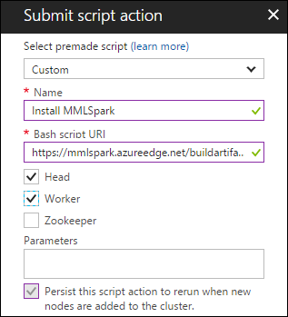
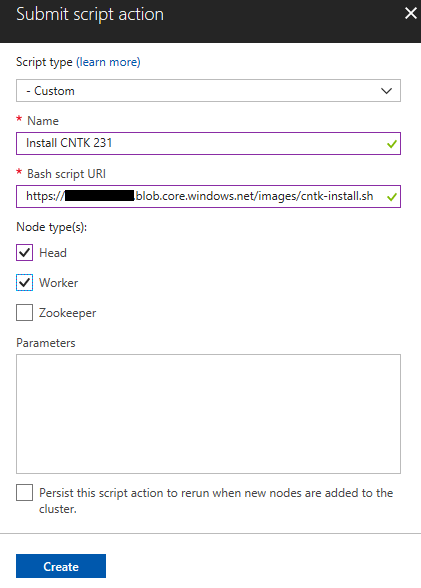

TODO: Add introduction.


<a name="Objectives"></a>
### Objectives ###

In this hands-on lab, you will learn how to:

- tk
- tk
- tk

<a name="Prerequisites"></a>
### Prerequisites ###

The following are required to complete this hands-on lab:

- An active Microsoft Azure subscription. If you don't have one, [sign up for a free trial](http://aka.ms/WATK-FreeTrial).
- tk
- tk

If you haven't completed the [previous lab in this series](../1%20-%20Ingest), you must do so before starting this lab.

---

<a name="Exercises"></a>
## Exercises ##

This hands-on lab includes the following exercises:

- [Exercise 1: Provision an HDInsight Spark Cluster](#Exercise1)
- [Exercise 2: Add MMLSpark and CNTK to the Spark Cluster](#Exercise2)
- [Exercise 3: Use a Jupyter Notebook to run Transfer Learning](#Exercise3)

Estimated time to complete this lab: **tk** minutes.

<a name="Exercise1"></a>
## Exercise 1: Provision an HDInsight Spark Cluster ##

TODO: Add introduction.

1. Open the [Azure Portal](https://portal.azure.com) in your browser. If asked to log in, do so using your Microsoft account.

1. tk.

	

	_tk_

1. tk.

	

	_tk_

1. tk.

	

	_tk_

1. tk.

	

	_tk_

1. tk.

	

	_tk_

TODO: Add closing.

<a name="Exercise2"></a>
## Exercise 2: Add MMLSpark and CNTK to the Spark Cluster ##

MMLSpark is the generally recommended package for running CNTK since CNTK and OpenCV are already included (and used in this lab).  At present, the MMLSpark distribution does not have the latest CNTK version, which we will need to run batch normalization training on a CPU (only GPU works in earlier CNTK versions).  Never fear:  we can run an additional script to achieve that goal.

1. To install MMLSpark on an existing [HDInsight Spark
Cluster](https://docs.microsoft.com/en-us/azure/hdinsight/), you can execute a
script action on the cluster head and worker nodes.  For instructions on running
script actions, see [this
guide](https://docs.microsoft.com/en-us/azure/hdinsight/hdinsight-hadoop-customize-cluster-linux#use-a-script-action-during-cluster-creation). The script action url is:
<https://mmlspark.azureedge.net/buildartifacts/0.10/install-mmlspark.sh>.

1. If you're using the Azure Portal to run the script action, go to `Script
actions` → `Submit new` in the `Overview` section of your cluster blade.  In the
`Bash script URI` field, input the script action URL provided above.  Mark the
rest of the options as shown on the screenshot below.

	

	_Submitting a Script Action to install MML Spark_

1. Submit, and the cluster should finish configuring within 10 minutes or so.

1. Next, open a text editor and save a file called ```cntk-install.sh```, and paste in the following code.

    ```bash
    #! /bin/bash

    # Install CNTK on every node. Skip if CNTK latest version is already installed
    CNTK_VER="2.3.1"
    CNTK_BASE_URL="https://cntk.ai/PythonWheel/CPU-Only"
    CNTK_PY27_WHEEL="cntk-$CNTK_VER-cp27-cp27mu-linux_x86_64.whl"
    CNTK_PY35_WHEEL="cntk-$CNTK_VER-cp35-cp35m-linux_x86_64.whl"
    ANACONDA_BASEPATH="/usr/bin/anaconda"

    # Install prerequisites
    sudo apt-get install -y openmpi-bin

    check_version_and_install() {
     CNTK_WHEEL=$1
     FIND_PKG=$(pip freeze | grep cntk)
     if [[ $FIND_PKG == "cntk"* ]]; then
       if [[ $FIND_PKG == *"$CNTK_VER" ]]; then
         echo "CNTK latest version is already installed. Skipping..."
       else
         echo "Updating CNTK..."
         pip install --upgrade --no-deps "$CNTK_BASE_URL/$CNTK_WHEEL"
       fi
     else
       echo "Installing CNTK..."
       pip install "$CNTK_BASE_URL/$CNTK_WHEEL"
     fi
    }

    # Install CNTK in Python 2.7
    source "$ANACONDA_BASEPATH/bin/activate"
    check_version_and_install $CNTK_PY27_WHEEL

    # Install CNTK in Python 3.5
    source "$ANACONDA_BASEPATH/bin/activate" py35
    check_version_and_install $CNTK_PY35_WHEEL

    source "$ANACONDA_BASEPATH/bin/deactivate"

    #Check if script action is running on head node. Exit otehrwise.
    function get_headnodes
    {
        hdfssitepath=/etc/hadoop/conf/hdfs-site.xml
        nn1=$(sed -n '/<name>dfs.namenode.http-address.mycluster.nn1/,/<\/value>/p' $hdfssitepath)
        nn2=$(sed -n '/<name>dfs.namenode.http-address.mycluster.nn2/,/<\/value>/p' $hdfssitepath)

        nn1host=$(sed -n -e 's/.*<value>\(.*\)<\/value>.*/\1/p' <<< $nn1 | cut -d ':' -f 1)
        nn2host=$(sed -n -e 's/.*<value>\(.*\)<\/value>.*/\1/p' <<< $nn2 | cut -d ':' -f 1)

        nn1hostnumber=$(sed -n -e 's/hn\(.*\)-.*/\1/p' <<< $nn1host)
        nn2hostnumber=$(sed -n -e 's/hn\(.*\)-.*/\1/p' <<< $nn2host)

        #only if both headnode hostnames could be retrieved, hostnames will be returned
        #else nothing is returned
        if [[ ! -z $nn1host && ! -z $nn2host ]]
        then
            if (( $nn1hostnumber < $nn2hostnumber )); then
                            echo "$nn1host,$nn2host"
            else
                            echo "$nn2host,$nn1host"
            fi
        fi
    }

    function get_primary_headnode
    {
            headnodes=`get_headnodes`
            echo "`(echo $headnodes | cut -d ',' -f 1)`"
    }

    PRIMARYHEADNODE=`get_primary_headnode`
    fullHostName=$(hostname -f)
    if [ "${fullHostName,,}" != "${PRIMARYHEADNODE,,}" ]; then
        echo "$fullHostName is not primary headnode. Skipping ambari config..."
        exit 0
    fi

    #Constants needed for changing ambari configs
    ACTIVEAMBARIHOST=headnodehost
    PORT=8080
    USERID=$(echo -e "import hdinsight_common.Constants as Constants\nprint Constants.AMBARI_WATCHDOG_USERNAME" | python)
    PASSWD=$(echo -e "import hdinsight_common.ClusterManifestParser as ClusterManifestParser\nimport hdinsight_common.Constants as Constants\nimport base64\nbase64pwd = ClusterManifestParser.parse_local_manifest().ambari_users.usersmap[Constants.AMBARI_WATCHDOG_USERNAME].password\nprint base64.b64decode(base64pwd)" | python)
    CLUSTERNAME=$(echo -e "import hdinsight_common.ClusterManifestParser as ClusterManifestParser\nprint ClusterManifestParser.parse_local_manifest().deployment.cluster_name" | python)

    # Stop and restart affected services
    stopServiceViaRest() {
     if [ -z "$1" ]; then
       echo "Need service name to stop service"
       exit 136
     fi
     SERVICENAME=$1
     echo "Stopping $SERVICENAME"
     curl -u "$USERID:$PASSWD" -i -H "X-Requested-By: ambari" -X PUT -d '{"RequestInfo": {"context" :"Stopping Service '"$SERVICENAME"' to install cntk"}, "Body": {"ServiceInfo": {"state": "INSTALLED"}}}' "http://$ACTIVEAMBARIHOST:$PORT/api/v1/clusters/$CLUSTERNAME/services/$SERVICENAME"
    }

    startServiceViaRest() {
      if [ -z "$1" ]; then
        echo "Need service name to start service"
        exit 136
      fi
      sleep 2
      SERVICENAME="$1"
      echo "Starting $SERVICENAME"
      startResult="$(curl -u $USERID:$PASSWD -i -H 'X-Requested-By: ambari' -X PUT -d '{"RequestInfo": {"context" :"Starting Service '"$SERVICENAME"' with cntk"}, "Body": {"ServiceInfo": {"state": "STARTED"}}}' http://$ACTIVEAMBARIHOST:$PORT/api/v1/clusters/$CLUSTERNAME/services/$SERVICENAME)"
      if [[ "$startResult" == *"500 Server Error"* || "$startResult" == *"internal system exception occurred"* ]]; then
        sleep 60
        echo "Retry starting $SERVICENAME"
        startResult="$(curl -u "$USERID:$PASSWD" -i -H "X-Requested-By: ambari" -X PUT -d '{"RequestInfo": {"context" :"Starting Service '"$SERVICENAME"' with cntk"}, "Body": {"ServiceInfo": {"state": "STARTED"}}}' http://$ACTIVEAMBARIHOST:$PORT/api/v1/clusters/$CLUSTERNAME/services/$SERVICENAME)"
      fi
      echo "$startResult"
    }

    # Stop affected services service
    stopServiceViaRest LIVY
    stopServiceViaRest JUPYTER

    # Start affected services
    startServiceViaRest LIVY
    startServiceViaRest JUPYTER
    ```

1. Using Microsoft Azure Storage Explorer, upload this file into the ```images``` container created in lab two.

	

	_CNTK Install script uploaded to Azure Blob Storage_

1. Using Copy URL, copy the name of the script.

	

	_Copy URL for the script_

1. Similar to the MML Spark installation, run a Script Action for installing CNTK.

	

	_Installing CNTK 2.3.1 to the HDInsight Spark Cluster_

TODO: Add closing.

<a name="Exercise3"></a>
## Exercise 3: Use a Jupyter Notebook to run Transfer Learning ##

TODO: Add introduction.

1. tk.

	

	_tk_

1. tk.

	

	_tk_

1. tk.

	

	_tk_

1. tk.

	

	_tk_

1. tk.

	

	_tk_

TODO: Add closing.

<a name="Summary"></a>
## Summary ##

TODO: Add summary.

---

Copyright 2018 Microsoft Corporation. All rights reserved. Except where otherwise noted, these materials are licensed under the terms of the MIT License. You may use them according to the license as is most appropriate for your project. The terms of this license can be found at https://opensource.org/licenses/MIT.
