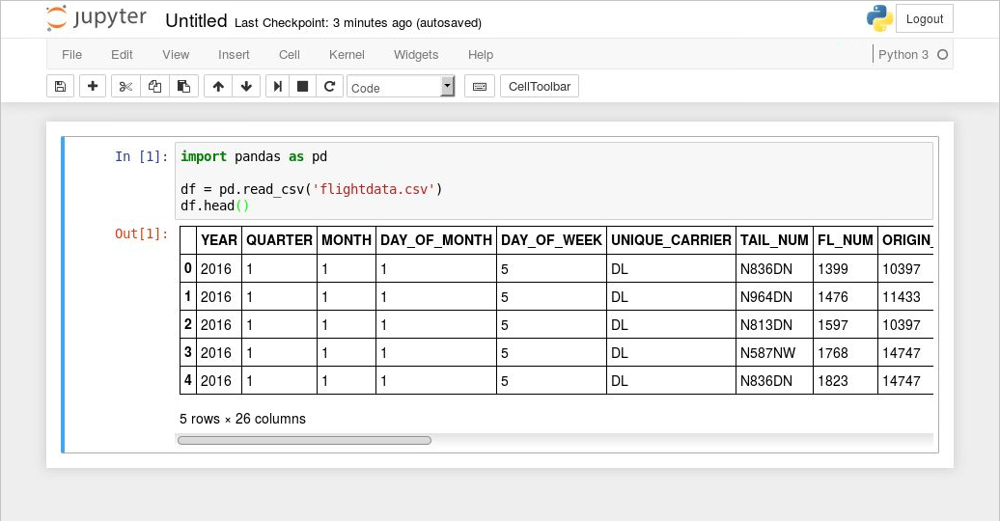
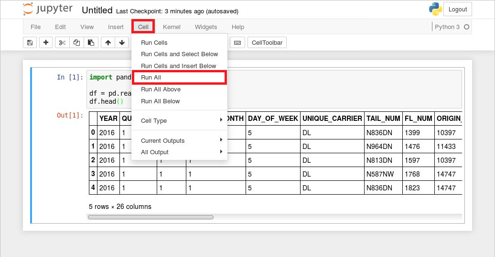
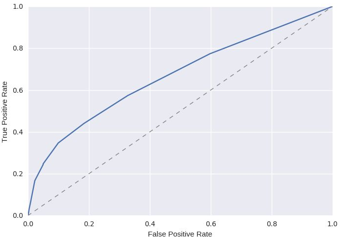
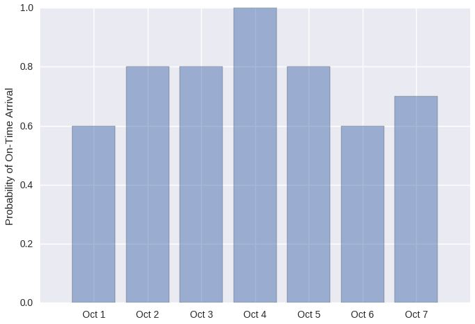
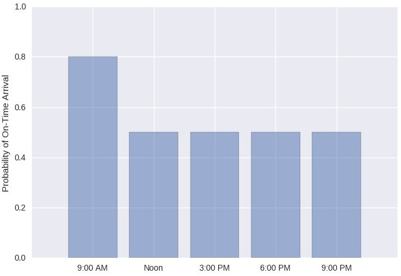

<a name="Overview"></a>
## Overview ##

Now that you that have trained a machine-learning model to perform predictive analytics, it's time to put it to work. In this lab, the final one in the series, you will write a function that uses the machine-learning model you built in the previous lab to predict whether a flight will arrive on time or late. And you will use [Matplotlib](https://matplotlib.org/), the popular plotting and charting library for Python, to visualize the results.


<a name="Objectives"></a>
### Objectives ###

In this hands-on lab, you will learn how to:

- Add Python functions to Jupyter notebooks
- Invoke the machine-learning model you built in the previous lab
- Use Matplotlib to create graphical output in Jupyter notebooks

<a name="Prerequisites"></a>
### Prerequisites ###

If you haven't completed the [previous lab in this series](#), you must do so before starting this lab.

---

<a name="Exercises"></a>
## Exercises ##

This hands-on lab includes the following exercises:

- [Exercise 1: Import Matplotlib](#Exercise1)
- [Exercise 2: Predict on-time arrivals](#Exercise2)
- [Exercise 3: Plot predictions](#Exercise3)

Estimated time to complete this lab: **20** minutes.

<a name="Exercise1"></a>
## Exercise 1: Import Matplotlib ##

In this exercise, you will import Matplotlib into the Jupyter notebook you have been working with and configure the notebook to support inline Matplotlib output.

1. Return to the Data Science VM that you worked with in the previous lab. If you are not connected to it, use [X2Go](https://wiki.x2go.org/doku.php/download:start) or the Xfce client of your choice to connect to the VM's Ubuntu desktop.

1. Open the Jupyter notebook that you worked with in the previous lab if it isn't already open.

	> An easy way to reopen the notebook is to double-click the Jupyter icon on the desktop. Once Jupyter opens in your browser, click **flights** to navigate to the "flights" directory, and **FlightData.ipynb** to open the notebook.

	

	_The FlightData notebook_

1. Use the **Cell** -> **Run All** command to run the notebook.

	

	_Running the notebook_

1. Add a cell to the notebook. Then add and execute the following statements:

	```python
	%matplotlib inline
	import matplotlib.pyplot as plt
	import seaborn as sns
	```

	The first statement is one of several [magic commands](http://ipython.readthedocs.io/en/stable/interactive/magics.html) supported by the Python kernel that you selected when you created the notebook. It enables Jupyter to render Matplotlib output in a notebook without making repeated calls to [show](https://matplotlib.org/devdocs/api/_as_gen/matplotlib.pyplot.show.html). And it must appear before any references to Matplotlib itself.

1. To see Matplotlib at work, execute the following code in a new cell to plot the [ROC curve](https://en.wikipedia.org/wiki/Receiver_operating_characteristic) for the machine-learning model you built in the previous lab: 

	```python
	from sklearn.metrics import roc_curve
	
	fpr, tpr, _ = roc_curve(test_y, probabilities[:, 1])
	plt.plot(fpr, tpr)
	plt.plot([0, 1], [0, 1], color='grey', lw=1, linestyle='--')
	plt.xlabel('False Positive Rate')
	plt.ylabel('True Positive Rate')
	```

1. Confirm that you see the following output:
   
   
   
   _ROC curve generated with Matplotlib_
   
The dotted line in the middle of the graph represents a 50-50 chance of obtaining a correct answer. The blue curve represents the accuracy of your model. More importantly, the fact that this chart appears at all demonstrates that you can use Matplotlib in a Jupyter notebook.

<a name="Exercise2"></a>
## Exercise 2: Predict on-time arrivals ##

The reason you built a machine-learning model is to predict whether a flight will arrive on time or late. In this exercise, you will write a Python function that calls the machine-learning model you built in the previous lab to compute the likelihood that a flight will be on time. Then you will use the function to analyze several flights.

1. Add a cell to the notebook and enter the following function definition. Then press **Ctrl+Enter** to execute the cell.

	```python
	def predict_delay(departure_date_time, origin, destination):
	    from datetime import datetime
	
	    try:
	        departure_date_time_parsed = datetime.strptime(departure_date_time, '%d/%m/%Y %H:%M:%S')
	    except ValueError as e:
	        return 'Error parsing date/time - {}'.format(e)
	    
	    month = departure_date_time_parsed.month
	    day = departure_date_time_parsed.day
	    day_of_week = departure_date_time_parsed.isoweekday()
	    hour = departure_date_time_parsed.hour
	    
	    origin = origin.upper()
	    destination = destination.upper()
	
	    input = [{'MONTH': month,
	              'DAY': day,
	              'DAY_OF_WEEK': day_of_week,
	              'CRS_DEP_TIME': hour,
	              'ORIGIN_ATL': 1 if origin == 'ATL' else 0,
	              'ORIGIN_DTW': 1 if origin == 'DTW' else 0,
	              'ORIGIN_JFK': 1 if origin == 'JFK' else 0,
	              'ORIGIN_MSP': 1 if origin == 'MSP' else 0,
	              'ORIGIN_SEA': 1 if origin == 'SEA' else 0,
	              'DEST_ATL': 1 if destination == 'ATL' else 0,
	              'DEST_DTW': 1 if destination == 'DTW' else 0,
	              'DEST_JFK': 1 if destination == 'JFK' else 0,
	              'DEST_MSP': 1 if destination == 'MSP' else 0,
	              'DEST_SEA': 1 if destination == 'SEA' else 0 }]
	
	    return model.predict_proba(pd.DataFrame(input))[0][0]
    ```

	This function takes as input a date and time, an origin airport code, and a destination airport code, and returns a value between 0.0 and 1.0 indicating the probability that the flight will arrive at its destination on time. It uses the machine-learning model you built in the previous lab to compute the probability. And to call the model, it passes a DataFrame containing the input values to ```predict_proba```. The structure of the DataFrame exactly matches the structure of the DataFrame depicted in Exercise 3, Step 3 of Lab 2.

	Note that dates input to the ```predict_delay``` function use the international date format ```dd/mm/year```.

1. Add a cell to the notebook and use the code below to compute the probability that a flight from New York to Atlanta on the evening of October 1 will arrive on time. Note that the year you enter is irrelevant because it isn't used by the model.

	```python
	predict_delay('1/10/2018 21:45:00', 'JFK', 'ATL')
	```

	Confirm that the output shows that the likelihood of an on-time arrival is 60%:

	

	_Predicting whether a flight will arrive on time_

1. Modify the code to compute the probability that the same flight a day later will arrive on time:

	```python
	predict_delay('2/10/2018 21:45:00', 'JFK', 'ATL')
	```

	How likely is this flight to arrive on time? If your travel plans were flexible, would you consider postponing your trip for one day?

1. Now modify the code to compute the probability that a morning flight the same day from Atlanta to Seattle will arrive on time:

	```python
	predict_delay('2/10/2018 10:00:00', 'ATL', 'SEA')
	```

	Is this flight likely to arrive on time?

You now have an easy way to predict, with a single line of code, whether a flight is likely to be on time or late. Feel free to experiment with other dates, times, origins, and destinations. But keep in mind that the results are only meaningful for the airport codes ATL, DTW, JFK, MSP, and SEA because those are the only airport codes the model was trained with.

<a name="Exercise3"></a>
## Exercise 3: Plot predictions ##

In this exercise, you will combine the ```predict_delay``` function you created in the previous exercise with Matplotlib to produce side-by-side comparisons of the same flight on consecutive days and flights with the same origin and destination at different times throughout the day. 

1. Add a new cell to the notebook and execute the following code to plot the probability of on-time arrivals for an evening flight from JFK to ATL over a range of days:

	```python
	import numpy as np
	
	labels = ('Oct 1', 'Oct 2', 'Oct 3', 'Oct 4', 'Oct 5', 'Oct 6', 'Oct 7')
	values = (predict_delay('1/10/2018 21:45:00', 'JFK', 'ATL'),
	          predict_delay('2/10/2018 21:45:00', 'JFK', 'ATL'),
	          predict_delay('3/10/2018 21:45:00', 'JFK', 'ATL'),
	          predict_delay('4/10/2018 21:45:00', 'JFK', 'ATL'),
	          predict_delay('5/10/2018 21:45:00', 'JFK', 'ATL'),
	          predict_delay('6/10/2018 21:45:00', 'JFK', 'ATL'),
	          predict_delay('7/10/2018 21:45:00', 'JFK', 'ATL'))
	alabels = np.arange(len(labels))
	
	plt.bar(alabels, values, align='center', alpha=0.5)
	plt.xticks(alabels, labels)
	plt.ylabel('Probability of On-Time Arrival')
	plt.ylim((0.0, 1.0))
	```

1. Confirm that the output looks like this:

	

	_Probability of on-time arrivals for a range of dates_

1. Modify the code to produce a similar chart for flights leaving JFK for MSP at 1:00 p.m. on April 10 through April 16. How does the output compare to the output in the previous step?

1. On your own, write code to graph the probability that flights leaving SEA for ATL at 9:00 a.m., noon, 3:00 p.m., 6:00 p.m., and 9:00 p.m. on January 30 will arrive on time. Confirm that the output matches this:

	

	_Probability of on-time arrivals for a range of times_

If you are new to Matplotlib and would like to learn more about it, you will find an excellent tutorial at https://www.labri.fr/perso/nrougier/teaching/matplotlib/. There is *much* more to Matplotlib than what was shown here, which is one reason why it is so popular in the Python community.

<a name="Summary"></a>
## Summary ##

In four hands-on labs, you learned how to:

- Create a Data Science VM in Azure
- Import data into the VM using ```curl```
- Create a Jupyter notebook in the VM
- Use [Pandas](https://pandas.pydata.org/pandas-docs/stable/) to clean and prepare data
- Use [Scikit-learn](http://scikit-learn.org/stable/) to build a machine-learning model
- Use [Matplotlib](https://matplotlib.org/) to visualize the results

Pandas, Scikit-learn, and Matplotlib are three of the most popular Python libraries on the planet. With them, you can prepare data for use in machine learning, build sophisticated machine-learning models from the data, and chart the output. They are among dozens of tools preinstalled in Microsoft's Data Science VM, and they are just the tip of the iceberg in terms of what you can do with it. For more information, see https://docs.microsoft.com/azure/machine-learning/data-science-virtual-machine/dsvm-tools-overview.

---

Copyright 2017 Microsoft Corporation. All rights reserved. Except where otherwise noted, these materials are licensed under the terms of the MIT License. You may use them according to the license as is most appropriate for your project. The terms of this license can be found at https://opensource.org/licenses/MIT.
