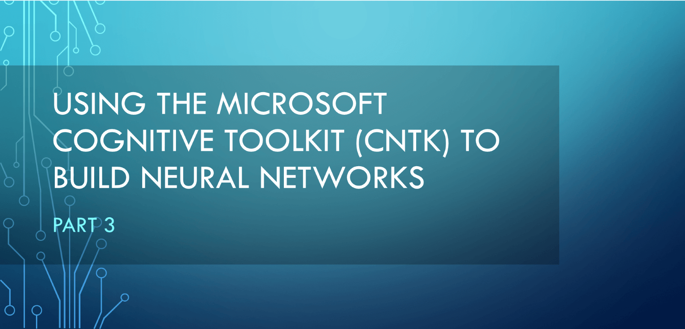

In the [previous lab](#), you used Azure Machine Learning Workbench to execute a Python script that converts raw data from the [MNIST database](http://yann.lecun.com/exdb/mnist/), which contains 60,000 scanned and normalized images of the hand-written digits 0 through 9, into data that can be used to train neural networks built with the [Microsoft Cognitive Toolkit](https://www.microsoft.com/en-us/research/product/cognitive-toolkit/), also known as CNTK. The script ran in a Docker container, received input from Azure blob storage, and wrote its output to Azure blob storage.

In this lab, the third of four in a series, you will return to Machine Learning Workbench and train three machine-learning models that rely on CNTK neural networks. The goal: to find the best model for recognizing hand-written digits with an eye toward operationalizing the model and building a client app that uses it in the next and final lab in this series.

### Objectives ###

In this hands-on lab, you will learn how to:

- Write Python code to train CNTK models
- Execute that code in Docker containers using Azure Machine Learning Workbench
- Determine the accuracy of a trained CNTK model

### Prerequisites ###

The following are required to complete this hands-on lab:

- An active Microsoft Azure subscription. If you don't have one, [sign up for a free trial](http://aka.ms/WATK-FreeTrial).
- A computer running Windows 10, Windows Server 2016, macOS Sierra, or macOS High Sierra
- [Azure Machine Learning Workbench](https://docs.microsoft.com/en-us/azure/machine-learning/preview/quickstart-installation)
- [Docker](https://www.docker.com/)

If you haven't completed the [previous lab in this series](#), you must do so before starting this lab.

---

## Exercises ##

This hands-on lab includes the following exercises:

- [Exercise 1: Train a neural network and score it for accuracy](#Exercise1)
- [Exercise 2: Train and score a second neural network](#Exercise2)
- [Exercise 3: Train and score a third neural network](#Exercise3)

Estimated time to complete this lab: **30** minutes.

## Exercise 1: Train a neural network and score it for accuracy ##

TODO: Add introduction.

1. tk.

	

	_tk_

1. tk.

	

	_tk_

1. tk.

	

	_tk_

1. tk.

	

	_tk_

1. tk.

	

	_tk_

TODO: Add closing.

## Exercise 2: Train and score a second neural network ##

TODO: Add introduction.

1. tk.

	

	_tk_

1. tk.

	

	_tk_

1. tk.

	

	_tk_

1. tk.

	

	_tk_

1. tk.

	

	_tk_

TODO: Add closing.

## Exercise 3: Train and score a third neural network ##

TODO: Add introduction.

1. tk.

	

	_tk_

1. tk.

	

	_tk_

1. tk.

	

	_tk_

1. tk.

	

	_tk_

1. tk.

	

	_tk_

TODO: Add closing.

## Summary ##

TODO: Add summary.

---

Copyright 2017 Microsoft Corporation. All rights reserved. Except where otherwise noted, these materials are licensed under the terms of the MIT License. You may use them according to the license as is most appropriate for your project. The terms of this license can be found at https://opensource.org/licenses/MIT.
