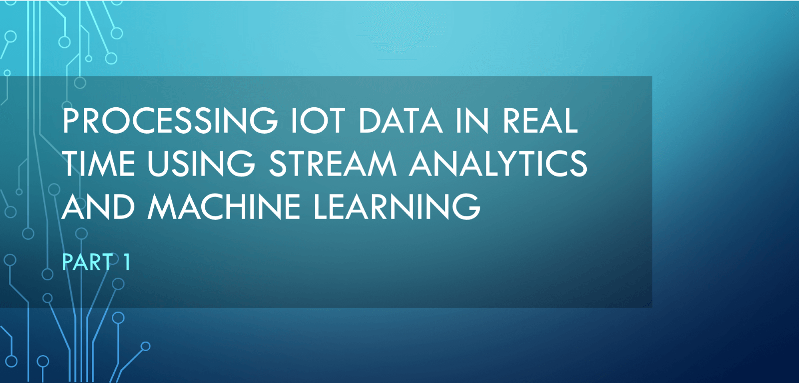

You are the leader of a group of climate scientists who are concerned about the dwindling polar-bear population in the Arctic. As such, your team has placed hundreds of cameras at strategic locations throughout the region and configured them to take pictures when they sense movement. Rather than manually examine each photograph to determine whether it contains a polar bear, you have been challenged to devise an automated system that processes data from these cameras in real time and displays an alert on a map when a polar bear is photographed. You need a solution that incorporates real-time stream processing to analyze raw data for potential sightings, and one that incorporates artificial intelligence (AI) and machine learning to determine with a high degree of accuracy whether a photo contains a polar bear. And you need it fast, because climate change won't wait.

In a series of four hands-on labs, you will build such a system using [Microsoft Azure](https://azure.microsoft.com/) and [Microsoft Cognitive Services](https://azure.microsoft.com/services/cognitive-services/). Specifically, you will use an [Azure Event Hub](https://azure.microsoft.com/services/event-hubs/) to ingest streaming data from simulated cameras, [Azure Storage](https://azure.microsoft.com/services/storage/?v=16.50) to store photographs, [Azure Stream Analytics](https://azure.microsoft.com/services/stream-analytics/) to process real-time data streams, Microsoft's [Custom Vision Service](https://azure.microsoft.com/services/cognitive-services/custom-vision-service/) to analyze photographs for polar pears, and [Microsoft Power BI](https://powerbi.microsoft.com/) to build a real-time dashboard for visualizing results.

In this lab, the first of four in a series, you will create a storage account and an Event Hub and connect them to an app that simulates a camera array. That app will be written in [Node.js](https://nodejs.org/) so it can run on any platform.

### Objectives ###

In this hands-on lab, you will learn how to:

- Create an Azure Event Hub
- Make authenticated calls to an Azure Event Hub
- Upload images to Azure blob storage from an app or device

### Prerequisites ###

The following are required to complete this hands-on lab:

- An active Microsoft Azure subscription. If you don't have one, [sign up for a free trial](http://aka.ms/WATK-FreeTrial).
- [Node.js](https://nodejs.org/)

---

## Exercises ##

This hands-on lab includes the following exercises:

- [Exercise 1: Create a storage account](#Exercise1)
- [Exercise 2: Create an Event Hub](#Exercise2)
- [Exercise 3: Stream data to the Event Hub](#Exercise3)

Estimated time to complete this lab: **30** minutes.

## Exercise 1: Create a storage account ##

TODO: Add introduction.

1. Open the [Azure Portal](https://portal.azure.com) in your browser. If asked to log in, do so using your Microsoft account.

1. tk.

	

	_tk_

1. tk.

	

	_tk_

1. tk.

	

	_tk_

1. tk.

	

	_tk_

1. tk.

	

	_tk_

TODO: Add closing.

## Exercise 2: Create an Event Hub ##

TODO: Add introduction.

1. tk.

	

	_tk_

1. tk.

	

	_tk_

1. tk.

	

	_tk_

1. tk.

	

	_tk_

1. tk.

	

	_tk_

TODO: Add closing.

## Exercise 3: Stream data to the Event Hub ##

TODO: Add introduction.

1. tk.

	

	_tk_

1. tk.

	

	_tk_

1. tk.

	

	_tk_

1. tk.

	

	_tk_

1. tk.

	

	_tk_

TODO: Add closing.

## Summary ##

TODO: Add summary.

---

Copyright 2017 Microsoft Corporation. All rights reserved. Except where otherwise noted, these materials are licensed under the terms of the MIT License. You may use them according to the license as is most appropriate for your project. The terms of this license can be found at https://opensource.org/licenses/MIT.
