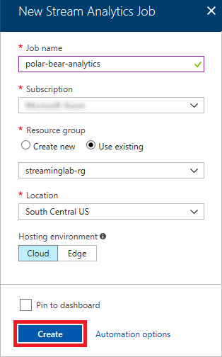
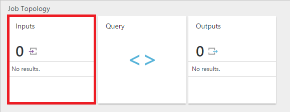
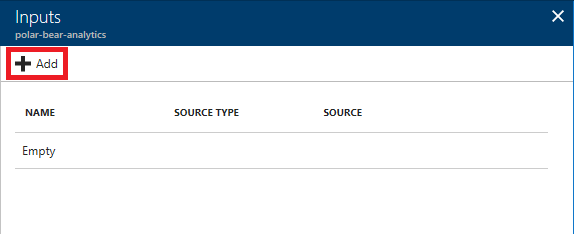
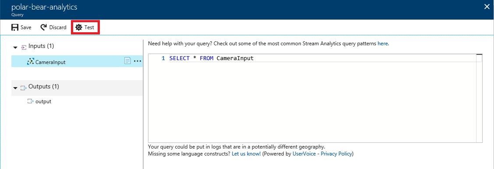
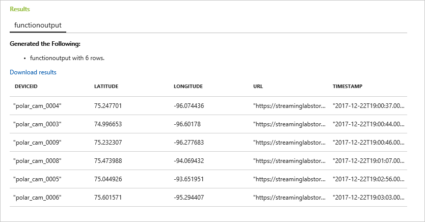
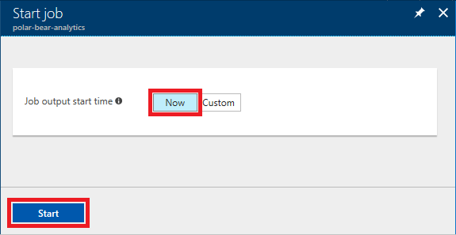

[Azure Stream Analytics](https://azure.microsoft.com/services/stream-analytics/) is a cloud-based service for ingesting high-velocity data streaming from devices, sensors, applications, Web sites, and other data sources and analyzing that data in real time. It supports a [SQL-like query language](https://msdn.microsoft.com/library/azure/dn834998.aspx) that works over dynamic data streams and makes analyzing constantly changing data no more difficult than performing queries on static data stored in traditional databases. With Azure Stream Analytics, you can set up jobs that analyze incoming data for anomalies or information of interest and record the results, present notifications on dashboards, or even fire off alerts to mobile devices. And all of it can be done at low cost and with a minimum of effort.

Scenarios for the application of real-time data analytics are legion and include fraud detection, identity-theft protection, optimizing the allocation of resources (think of an Uber-like transportation service that sends drivers to areas of increasing demand *before* that demand peaks), click-stream analysis on Web sites, and countless others. Having the ability to process data *as it comes in* rather than waiting until after it has been aggregated offers a competitive advantage to businesses that are agile enough to make adjustments on the fly.

In this lab, the second of four in a series, you will create an Azure Stream Analytics job and connect it to the IoT hub you created in the [previous lab](#). Then you will use it to analyze data streaming in from the simulated camera array that provides input to the IoT hub. 


<a name="Objectives"></a>
### Objectives ###

In this hands-on lab, you will learn how to:

- Create a Stream Analytics job and test queries on sample data streams
- Run a Stream Analytics job and perform queries on live data streams

<a name="Prerequisites"></a>
### Prerequisites ###

The following are required to complete this hands-on lab:

- An active Microsoft Azure subscription. If you don't have one, [sign up for a free trial](http://aka.ms/WATK-FreeTrial).
- [Node.js](https://nodejs.org/)

If you haven't completed the [previous lab in this series](#), you must do so before starting this lab.

---

<a name="Exercises"></a>
## Exercises ##

This hands-on lab includes the following exercises:

- [Exercise 1: Create a Stream Analytics job](#Exercise1)
- [Exercise 2: Prepare a query and test with sample data](#Exercise2)
- [Exercise 3: Write an Azure Function and connect it to Stream Analytics](#Exercise3)
- [Exercise 4: Stream data from the camera array](#Exercise4)
- [Exercise 5: Analyze the live data stream](#Exercise5)

Estimated time to complete this lab: **30** minutes.

<a name="Exercise1"></a>
## Exercise 1: Create a Stream Analytics job ##

In this exercise, you will use the Azure Portal to create a Stream Analytics job and connect it to the IoT hub you created in the previous lab.

1. Open the [Azure Portal](https://portal.azure.com) in your browser. If asked to log in, do so using your Microsoft account.

1. Click **+ New**, followed by **Internet of Things** and **Stream Analytics job**.

    

    _Creating a Stream Analytics job_

1. Name the job "polar-bear-analytics" and place it in the "streaminglab-rg" resource group that you created in the previous lab. Specify **South Central US** as the location. (That's important, because your IoT hub is in the same region, and while you are not charged for data that moves within a data center, you typically *are* charged for data that moves *between* data centers. In addition, locating services that talk to each other in the same region reduces latency.) Make sure **Hosting environment** is set to **Cloud**, and then click the **Create** button.

    

    _Specifying parameters for the Stream Analytics job_

1. Open the "streaminglab-rg" resource group and click **polar-bear-analytics** to open the Stream Analytics job in the portal. If the Stream Analytics doesn't appear in the resource group, click the **Refresh** button at the top of the blade until it does.

    

    _Opening the Stream Analytics job_

1. Click **Inputs** to add an input to the Stream Analytics job.

    

    _Adding an input_

1. Click **+ Add**.

    

    _Adding an input_

1. Type "CameraInput" (without quotation marks) into the **Input alias** box. Make sure **Source Type** is set to **Data stream** and set **Source** to **IoT hub**. Select the IoT hub that you created in the previous lab and accept the defaults everywhere else. Then click the **Create** button at the bottom of the blade.

    

    _Creating an input_

After a few moments, the new input — "CameraInput" — appears in the list of inputs for the Stream Analytics job. This is the only input you will create, but be aware that you can add any number of inputs to a Stream Analytics job. In the [Stream Analytics Query Language](https://msdn.microsoft.com/library/azure/dn834998.aspx), each input is treated as a separate data source similar to tables in a relational database. The query language is extremely expressive, even allowing input streams to be joined in a manner similar to joining database tables.

<a name="Exercise2"></a>
## Exercise 2: Prepare a query and test with sample data ##

The heart of a Stream Analytics job is the query that extracts information from the data stream. It is always a good idea to test a query using sample data before deploying it against a live data stream, because with sample data, you can verify that a known set of inputs produces the expected outputs.

In this exercise, you will enter a query into the Stream Analytics job you created in the previous exercise and test it with sample data.

1. Return to the Stream Analytics job in the portal and click **Query**.

    

    _Opening the query viewer_

1. Click the **ellipsis** (the three dots) to the right of **CameraInput** and select **Upload sample data from file** from the menu.

    

    _Uploading sample data_

1. Click the **folder** icon on the right and select the file named **sample-data.json** from the [resources included with this lab](#). Then click **OK** to upload the file.

    

    _Uploading sample-data.json_

1. When the upload is complete, type the following query into the query window, and then click the **Test** button to execute it against the sample data:

	```sql
	SELECT * FROM CameraInput
	```

	

	_Testing a query_

1. Confirm that you see the output pictured below. The test data contains 50 rows, each representing an event transmitted to the IoT hub by one of the cameras in the camera array. DEVICEID is the camera's device ID, LATITUDE and LATITUDE specify the camera's geographic location, URL is the URL of the blob containing the picture that was taken, and TIMESTAMP is the time at which the picture was taken. The other fields were added by Azure.

	

	_Query result_

1. One of the key features of the Stream Analytics Query Language is its ability to group results using windows of time whose length you specify. Windowing is enacted by using the keywords [TumblingWindow](https://msdn.microsoft.com/library/azure/dn835055.aspx), [HoppingWindow](https://msdn.microsoft.com/library/azure/dn835041.aspx), and [SlidingWindow](https://msdn.microsoft.com/library/azure/dn835051.aspx) in a GROUP BY clause. To demonstrate, enter the following query to count the number of times the cameras were triggered each minute and click **Test** to execute it:

	```sql
	SELECT System.Timestamp as [Time Ending],
	    COUNT(*) AS [Times Triggered]
	FROM CameraInput TIMESTAMP BY timestamp
	GROUP BY TumblingWindow(n, 1)
	```
	> [TIMESTAMP BY](https://msdn.microsoft.com/library/azure/mt573293.aspx) is an important element of the Stream Analytics Query Language. If it was omitted from the query above, you would be querying for the number of events that arrived *at the event hub* each minute rather than the number of events that occurred at the camera locations. TIMESTAMP BY allows you to specify a field in the input stream as the event time.

1. Confirm that you see the output below:

	

	_Query result using TumblingWindow_

1. Now it's time to check for photos snapped by the same camera within 10 seconds. *This is the query you will use in the next exercise against a live data stream*. The assumption is that since polar bears tend to move rather slowly, we will ignore pictures taken more than 10 seconds apart, but if the same camera snaps two pictures within 10 seconds, it is worth examining the pictures to see if one of them contains a polar bear.

	Enter the following query and click **Test** to execute it:

	```sql
	SELECT C1.deviceId, C1.latitude, C1.longitude, C2.url
	FROM CameraInput C1 TIMESTAMP BY timestamp
	JOIN CameraInput C2 TIMESTAMP BY timestamp
	ON C1.deviceId = C2.deviceId
	AND DATEDIFF(ss, C1, C2) BETWEEN 0 AND 10
	AND C1.Timestamp != C2.Timestamp
	```

1. This time the output should contain six rows, each representing two photographs taken by the same camera within 10 seconds and containing the URL of one of the pictures.

	> If you wanted to include *both* URLs in the output, how would you modify the query to do it?

	

	_Cameras that snapped two pictures within 10 seconds_

1. Click the **Save** button at the top of the blade to save the query. Then click **Yes** when asked to confirm.

With the query now formulated, tested against a set of sample data, and saved, it's time to deploy it against a live data stream.

<a name="Exercise3"></a>
## Exercise 3: Write an Azure Function and connect it to Stream Analytics ##

The Stream Analytics query that you tested in the previous exercise uses a simple criterion: if the same camera snaps two pictures within 10 seconds, there *might* be a polar bear. But the ultimate goal is to determine with a great deal of confidence whether there really *is* a polar bear. That means employing machine learning.

One way to connect a Stream Analytics job to a machine-learning model running in the cloud is to write an [Azure Function](https://azure.microsoft.com/services/functions/) and connect it to a Stream Analytics job as an output. The function, which is invoked each time Stream Analytics produces an output, can then call out to the machine-learning model. In this exercise, you will write an Azure Function, connect it to Stream Analytics, and stub it out so that it can be connected to a machine-learning model in the next lab.

1. tk.

	

	_tk_

1. tk.

	

	_tk_

1. tk.

	

	_tk_

1. tk.

	

	_tk_

1. tk.

	

	_tk_

TODO: Add closing.

<a name="Exercise4"></a>
## Exercise 4: Stream data from the camera array ##

Now that the Stream Analytics job is prepared and an Azure Function has been created to receive output, the next step is to generate a live data stream and verify that the solution you've built thus far works as intended. In this exercise, you will use Node.js to stream events from the simulated camera array.

1. Return to the project directory that you created in the previous lab and create a file in it named **run.js**. Then paste the following code into the file:

	```javascript
	'use strict';
	
	class Camera {
	    constructor(id, latitude, longitude, key, files) {
	        this._id = id;
	        this._latitude = latitude;
	        this._longitude = longitude;
	        this._key = key;
	        this._files = files.slice(0);
	        this._ready = false;
	    }
	
	    get id() {
	        return this._id;
	    }
	
	    connect(iotHubName, storageAccountName, storageAccountKey, callback) {
	        // Connect to blob storage
	        var azure = require('azure-storage');
	        this._storageAccountName = storageAccountName;
	        this._blobService = azure.createBlobService(storageAccountName, storageAccountKey);
	
	        // Connect to the IoT hub
	        var connectionString = 'HostName=' + iotHubName + '.azure-devices.net;DeviceId=' + this._id + ';SharedAccessKey=' + this._key;
	        var clientFromConnectionString = require('azure-iot-device-mqtt').clientFromConnectionString;
	        this._client = clientFromConnectionString(connectionString);
	
	        this._client.open((err) => {
	            if (!err) {
	                this._ready = true;
	            }
	
	            callback(this._ready);
	        });
	    }
	
	    start() {
	        // Register first callback for 5 to 30 seconds
	        setTimeout(this.timer, (Math.random() * 25000) + 5000, this);
	    }
	
	    timer(self) {
	        if (self._ready === true) {
	            // "Trigger" the camera with a random photo
	            var index = Math.floor(Math.random() * self._files.length);
	            self.trigger(self._files[index], (err, result) => {});
	
	            // Register another callback for 5 to 30 seconds
	            setTimeout(self.timer, (Math.random() * 25000) + 5000, self);
	        }
	    }
	
	    trigger(imageFileName, callback) {
	        if (this._ready === true) {
	            // Upload the image to blob storage
	            this.upload(imageFileName, (err, result) => {
	                if (err) {
	                    callback(err, result);
	                }
	                else {
	                    // Send an event to the IoT hub
	                    this.send(imageFileName, (err, result) => {
	                        console.log(this._id + ': https://' + this._storageAccountName + '.blob.core.windows.net/photos/' + imageFileName);
	                        callback(err, result);
	                    });
	                }
	            });
	        }
	    }
	
	    upload(imageFileName, callback) {
	        this._blobService.createBlockBlobFromLocalFile('photos', imageFileName, 'photos/' + imageFileName, (err, result) => {
	            callback(err, result);
	        });
	    }
	        
	    send(imageFileName, callback) {
	        var Message = require('azure-iot-device').Message;
	
	        var data = {
	            'deviceId' : this._id,
	            'latitude' : this._latitude,
	            'longitude' : this._longitude,
	            'url' : 'https://' + this._storageAccountName + '.blob.core.windows.net/photos/' + imageFileName,
	            'timestamp' : new Date().toUTCString()
	        };
	
	        var message = new Message(JSON.stringify(data));
	
	        this._client.sendEvent(message, (err, result) => {
	            callback(err, result);
	        });        
	    }
	}
	
	var iotHubName = 'streaminglab-iot-hub';
	var storageAccountName = 'streaminglabstorage';
	var storageAccountKey = 'y+uxm+lx6WkQzZm7ki4hWM2BE2z7OIZHPuvZPwNdOQq7eDj6BJ1fDei/zguovanGAKigypxURVTK8yhwilYE1A==';
	
	// Load image file names
	var fs = require('fs');
	
	fs.readdir('photos', (err, files) => {
	    // Create an array of cameras
	    var cameras = JSON.parse(fs.readFileSync('cameras.json', 'utf8')).map(
	        camera => new Camera(
	            camera.deviceId,
	            camera.latitude,
	            camera.longitude,
	            camera.key,
	            files
	        )
	    );
	
	    // Start the cameras
	    cameras.forEach(camera => {
	        camera.connect(iotHubName, storageAccountName, storageAccountKey, status => {
	            if (status === true) {
	                console.log(camera.id + ' connected');
	                camera.start();
	            }
	            else {
	                console.log(camera.id + ' failed to connect');
	            }
	        })
	    });
	});
	```

	TODO: Add explanation.

1. Open a Command Prompt or terminal window and ```cd``` to the project directory. Then use the following command to run **run.js**:

	```
	node run.js
	```

1. Confirm that you see output similar to the following, indicating that all 10 "cameras" are connected to the IoT hub:

	```
	polar_cam_0003 connected
	polar_cam_0005 connected
	polar_cam_0001 connected
	polar_cam_0009 connected
	polar_cam_0004 connected
	polar_cam_0006 connected
	polar_cam_0008 connected
	polar_cam_0007 connected
	polar_cam_0002 connected
	polar_cam_0010 connected
	```

	Note that the order in which the cameras connect to the IoT hub will probably differ from what's shown here, and will probably even vary from run to run.

1. After a few seconds, additional output should appear. Each line corresponds to an event transmitted from a camera to the IoT hub. The output will look something like this:

	```
	polar_cam_0008: https://streaminglabstorage.blob.core.windows.net/photos/image_24.jpg
	polar_cam_0004: https://streaminglabstorage.blob.core.windows.net/photos/image_10.jpg
	polar_cam_0005: https://streaminglabstorage.blob.core.windows.net/photos/image_26.jpg
	polar_cam_0007: https://streaminglabstorage.blob.core.windows.net/photos/image_27.jpg
	polar_cam_0001: https://streaminglabstorage.blob.core.windows.net/photos/image_15.jpg
	polar_cam_0007: https://streaminglabstorage.blob.core.windows.net/photos/image_20.jpg
	polar_cam_0003: https://streaminglabstorage.blob.core.windows.net/photos/image_18.jpg
	polar_cam_0005: https://streaminglabstorage.blob.core.windows.net/photos/image_21.jpg
	polar_cam_0001: https://streaminglabstorage.blob.core.windows.net/photos/image_20.jpg
	polar_cam_0009: https://streaminglabstorage.blob.core.windows.net/photos/image_26.jpg
	```

Confirm that the cameras are running and generating events as shown above. **Leave them running**, and then proceed to the next exercise.

<a name="Exercise5"></a>
## Exercise 5: Analyze the live data stream ##

In this exercise, you will start the Stream Analytics job so it can examine the live data stream emanating from the cameras. Then you will check the output from the Azure Function to ensure that data is being received by Stream Analytics, queried, and output to the function.

1. Return to the Stream Analytics job in the [Azure Portal](https://portal.azure.com) and click the **Start** button.

    

    _Starting the Stream Analytics job_

1. Make sure **Job output start time** is set to **Now**, and then click the **Start** button to start running the job.

    

    _Specifying the job start time_

1. Go to the Azure Function that you created in [Exercise 3](#Exercise3) in the portal and tk.

	

	_tk_

1. tk.

	

	_tk_

1. tk.

	

	_tk_

1. Return to the Stream Analytics job in the portal and click **Stop** to stop it. Then click **Yes** when asked to confirm that you want to stop the job.

1. Return to the Command Prompt or terminal window in which **run.js** is running and press **Ctrl+C** to stop it (and therefore stop the flow of events from the simulated cameras).

You have confirmed that Stream Analytics is receiving input from the IoT hub and that the Azure Function is receiving output from Stream Analytics.

<a name="Summary"></a>
## Summary ##

TODO: Add summary.

---

Copyright 2017 Microsoft Corporation. All rights reserved. Except where otherwise noted, these materials are licensed under the terms of the MIT License. You may use them according to the license as is most appropriate for your project. The terms of this license can be found at https://opensource.org/licenses/MIT.
