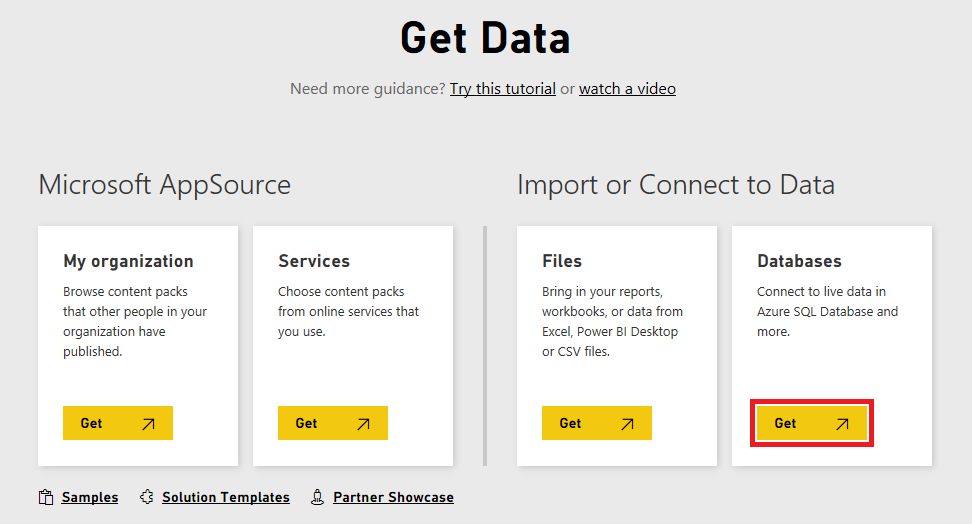
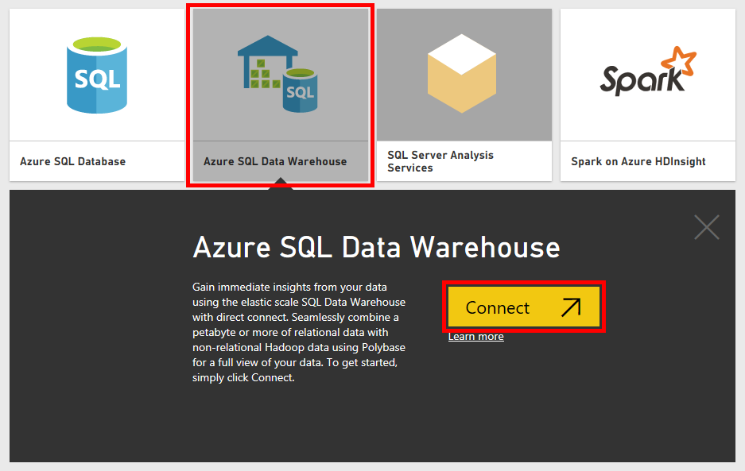
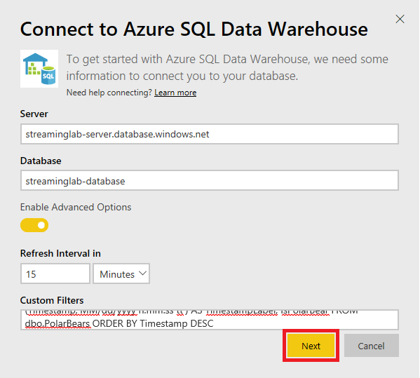
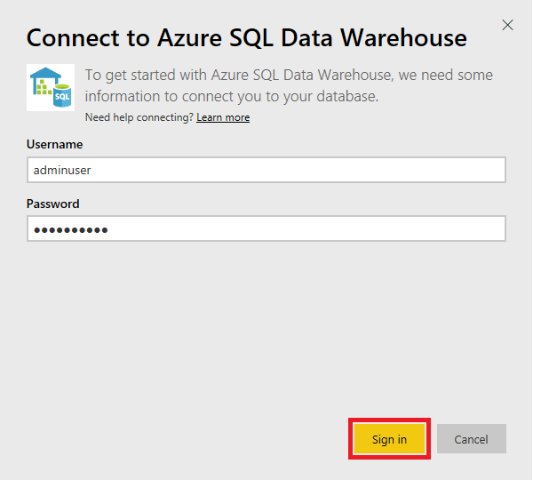
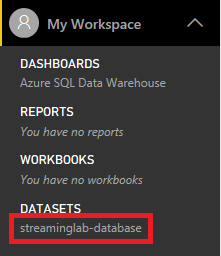
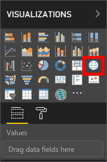
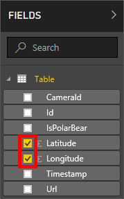

The goal of business intelligence is being able to quickly identify and respond to ever-changing trends in business and industry. Whether you’re a data analyst delivering reports and analytics to your organization or a stakeholder or decision-maker in need of critical insights, Power BI can organize and unify all of your organization's data to provide a clear view of your world.

[Microsoft Power BI](https://powerbi.microsoft.com/en-us/mobile/) was created to address the data explosion in commercial and academic organizations, the need to analyze that data, and the need for rich, interactive visuals to represent the data and reveal key insights. It contains a suite of tools that assist in data analysis, from data discovery and collection to data transformation, aggregation, sharing, and collaboration. Moreover, it allows you to create rich visualizations and package them in interactive dashboards.

In this lab, the fourth of four in a series, you will connect Microsoft Power BI to the Azure SQL database you created in the previous lab to capture information emanating from the virtual camera array you deployed in the Arctic. Then you will use Power BI to build a dashboard that shows where polar bears are being spotted.


<a name="Objectives"></a>
### Objectives ###

In this hands-on lab, you will learn how to:

- Connect Power BI to an Azure SQL database
- Use Power BI to visualize data written to the database
- Create a dashboard that can be shared with colleagues

<a name="Prerequisites"></a>
### Prerequisites ###

The following are required to complete this hands-on lab:

- An active Microsoft work/school or organizational account.
- An active Microsoft Power BI subscription. If you don't have one, [sign up for a free trial](https://app.powerbi.com/signupredirect?pbi_source=web).

If you haven't completed the [previous lab in this series](#), you must do so before starting this lab.

---

<a name="Exercises"></a>
## Exercises ##

This hands-on lab includes the following exercises:

- [Exercise 1: Connect Power BI to Azure SQL](#Exercise1)
- [Exercise 2: Build a report in Power BI](#Exercise2)
- [Exercise 3: Enhance and format visualizations](#Exercise3)
 
Estimated time to complete this lab: **30** minutes.

<a name="Exercise1"></a>
## Exercise 1: Connect Power BI to Azure SQL ##

In the previous lab, you used the [Custom Vision Service](https://azure.microsoft.com/services/cognitive-services/custom-vision-service/) to train an image-classification model to differentiate between different types of Arctic wildlife, and modified the Azure Function you wrote to write the results to an Azure SQL database. The first step in using Microsoft Power BI to explore and visualize this data is connecting it to Power BI as a data source. In this exercise, you will connect the [Power BI service](https://docs.microsoft.com/en-us/power-bi/service-get-started) to the Azure SQL database.

1. Go to the Power BI service portal at https://app.powerbi.com. If asked to log in, do so with your work/school or organizational account.

	> There are two types of Microsoft accounts: personal Microsoft accounts and work/school accounts, also known as organizational accounts. Power BI accepts the latter but not the former. If you have an Office 365 subscription, it uses your work/school account. You can have a work/school account without having an Office 365 subscription, however. For an explanation of the difference between personal Microsoft accounts and work/school accounts, see [Understanding Microsoft Work And Personal Accounts](http://www.brucebnews.com/2016/06/finding-your-way-through-microsofts-maze-of-work-and-personal-accounts/).

1. Click **Get Data** in the menu bar on the left.

    

    _Accessing Power BI data sources_

1. Click the **Get** button in the "Databases" tile.

    

    _Connecting to a database_

1. Click **Azure SQL Data Warehouse**, and then click **Connect**.

    

    _Connecting to an Azure SQL Data Warehouse_

1. Enter the server's host name (the server name plus ".database.windows.net" since it's an Azure SQL database server) and database name that you specified when you created the database and database server in the previous lab. Enable **Enable Advanced Options**, and then type the query below into the **Custom Filters** box to select all rows in the "PolarBears" table that have been added in the last 15 minutes. When you're done, click **Next**.

	```sql
	SELECT Id, CameraId, Latitude, Longitude, Url, Timestamp, FORMAT(Timestamp,'MM/dd/yyyy h:mm:ss tt') AS TimestampLabel, IsPolarBear FROM dbo.PolarBears WHERE (Timestamp > DATEADD(MINUTE, -15, GETDATE()))
	```

    

    _Specifying a database and filter_

1. In the subsequent dialog, enter the user name and password you specified when you created the database server. Then click **Sign in**.

    

    _Entering admin credentials_

After a short delay, Power BI will connect to the database and import a dataset using the query you provided. The next step is create a report using that dataset.

<a name="Exercise2"></a>
## Exercise 2: Build a report in Power BI ##

Visualizations (or simply "visuals") are the primary element that make up Power BI reports and dashboards. In this exercise, you will use the Power BI report designer to create visuals from the database you connected to in the previous exercise, and adjust filters and aggregates to refine the way the data is displayed.

1. Click **streaminglab-database** under **My Workspace** > **Datasets** in the panel on the left. This is the dataset that was imported when you connected to the database in the previous exercise.

	

	_Opening the dataset_

1. tk.

	

	_The Visualizations and Fields panels_

1. Click the **Map** visual from the "Visualizations" panel to add a geographical map visual to the report design workspace.
	
	
	_Selecting the Map visual_

1. Add both the **Latitude** and **Longitude** fields to the Map visual by selecting them individually in the "Fields" panel, after which the Map visual will display an informational message instructing you to remove any summary calculations from the associated fields. 
	
	
	_The Visualizations and Fields panels_

1. To remove summary calculations, select the **Latitude** > **Average of Latitude** drop-down in the "Visualizations" panel, then select **Don't summarize**. Repeat this step for the **Longitude** > **Average of Longitude** field.

	
	_Removing the summary calculation from the Latitude field_

1. Still in the "Fields" panel, add the **IsPolarBear** field to the Map visual, and observe the display of the Map visual with associated pushpin "bubble" elements corresponding to recent camera events from the prediction data.

1. Deselect the Map visual, by selecting any empty area of the report design workspace, then select the **CameraId**, **IsPolarBear**, and **TimestampLabel** fields from the Fields panel, to add a default "Table" visual to the report workspace. The Table visual is appropriate for viewing row and column data in a Power BI report.

1. Deselect the Table visual, then select the **IsPolarBear** and **Latitude** fields from the "Fields" panel to add an additional Table visual to the workspace, then select the **PieChart visual** from the "Visualizations" panel to change the visual style from Table to PieChart. 

1. Select the **Latitude** > **Average of Latitude** drop-down in the "Visualizations" panel, and change it to **Count** to display a breakdown of positive Polar Bear sightings in a pie chart format. The PieChart visual is appropriate for viewing percentage comparisons in a Power BI report.

1. Finally, deselect the PieChart visual, then click the **Slicer visual** from the "Visualizations" panel to add a Slicer to the workspace. With the Slicer active, select the **IsPolarBear** field in the "Fields" panel. The Slicer visual is a great way of filtering information in a Power BI report, as it narrows the portion of the dataset shown in the other visualizations on the page.

1. Test the ability of the Slicer to filter information in the report by selecting and deselecting True and False values from the visual and observe the real-time changes to other report visuals, including geographical map locations.

1. Save your report by clicking **Save** from the top-right report designer menu, enter "Polar Bear activity" as the report name, then click **Save**.

With a number of rich, interactive visuals added to your Power BI report, it's pretty simple to get up-to-date insight into Polar Bear sightings and camera activity. For example, the Map visual is fully interactive, making it easy to zoom in and out of a region, or select a pushpin to view information associated with specific activity, such as camera identification and activity timestamps.

In the final exercise, you will be "souping up" your report by adjusting the layout, and formatting report visuals, to create beautiful, compelling report experience.

<a name="Exercise3"></a>
## Exercise 3: Enhance and format visualizations ##

In this exercise, you will be adjusting the layout and formatting of the report created in the previous exercise, to deliver a stunning, interactive report using Power BI theming, formatting, and layout tools.

1. Open the [Power BI services portal](https://powerbi.microsoft.com "Power BI services portal"), if not already open from the previous exercise, and select **Reports** > **Polar Bear activity** from the left-navigation menu to view your report.

1. Select the **Map visual** by placing your mouse cursor anywhere within the visual, then select the **Format tab** from the "Visualizations" panel.

	
	_The Visualizations panel Format tab_

1. Expand the **Legend** group and change "Legend Name" to "Polar Bear sighted?".

1. Expand the **Data colors** group, select the color drop-down for the "False" value, select **Custom Color**, then enter "00FF00" (pure green) for the value. Repeat this process for the "True" value and enter "FF0000" (pure red) for the value, then observer the changes to the Map visual. Red values now indicate Polar Bear activity while green values indicate non-Polar Bear activity.

1. Still on the Format tab, expand the **Bubbles** group and change the size of map bubbles from 1% to **30%** for improved map visibility.

1. Expand the **Map styles** group and change the theme from Road to **Aerial** for a more realistic view of map terrain.

1. Finally, change the value of "Title" to **Off**.

1. Select the **PieChart visual** by placing your mouse cursor anywhere within the visual, then select the **Format tab** from the "Visualizations" panel.

1. Expand the **Data colors** group, and repeat the process of changing the "False" value to "00FF00" (pure green) and the "True" color to "FF0000" (pure red) for the value, then observer the changes to the PieChart visual.

1. Expand the **Data labels** group and change "Label style" to **Data value, percent of total**.

1. Finally, expand the **Title** group and change the value to "Polar Bear sightings by proportion", and observe the changes to the visual.

1. Select the **Table visual** by placing your mouse cursor anywhere within the visual, then select the **Format tab** from the "Visualizations" panel.

1. Expand the **Table style** group and change "Style" to **Alternative rows**.

1. Finally, expand the **Title** group, change "Title" to **On**, then change **Text Title** to "Camera activity", and observe the changes to the visual.

1. Select the **Slicer visual** by placing your mouse cursor anywhere within the visual, then select the **Format tab** from the "Visualizations" panel.

1. Expand the **Selection Controls** group and change "Single Select" to **Off**.

1. Still on the Format tab, change the value of "Header" to **Off**.
 
1. Finally, expand the **Title** group, change "Title" to **On**, then change **Text Title** to "Show where Polar Bear activity is:", and observe the changes to the visual.

1. Edit the report title by double-clicking the "Page 1" label in the bottom left of the report workspace, then rename the report to "Hourly Polar Bear Activity".

With your report visuals formatted, the process of adjusting layouts can be accomplished by dragging element corners and visuals around the workspace until a desired layout is achieved.

1. Drag and resize each report visual individually to create a clean, logical layout for easy user interaction and viewing, providing the most space to the Map visual, and the least amount of space to the Slicer visual.

1. Save your report by clicking **Save** from the top-right report designer menu, enter "Polar Bear activity" as the report name, then click **Save**.
 
With your Power BI report formatted and the layout adjusted for a great experience, sharing your report is a breeze. Sharing can be achieved in a number of ways, the most popular being to create a Power BI Dashboard and sharing the Dashboard with other users in your organization.

To create and share a Power BI Dashboard:

1. In the Power BI report workspace, click **Pin Live Page**, select **New Dashboard**, then name the Dashboard "Hourly Polar Bear Activity", and click **Pin Live**.

1. Select **Hourly Polar Bear Activity** from the "Dashboards" panel in the left-menu, then click **Share** in the top-right workspace menu. More information about sharing dashboards can be found at: [Share Power BI Dashboards and Reports](https://docs.microsoft.com/en-us/power-bi/service-how-to-collaborate-distribute-dashboards-reports "Share Power BI Dashboards and Reports").

<a name="Summary"></a>
## Summary ##

TODO: Add summary.

---

Copyright 2017 Microsoft Corporation. All rights reserved. Except where otherwise noted, these materials are licensed under the terms of the MIT License. You may use them according to the license as is most appropriate for your project. The terms of this license can be found at https://opensource.org/licenses/MIT.
